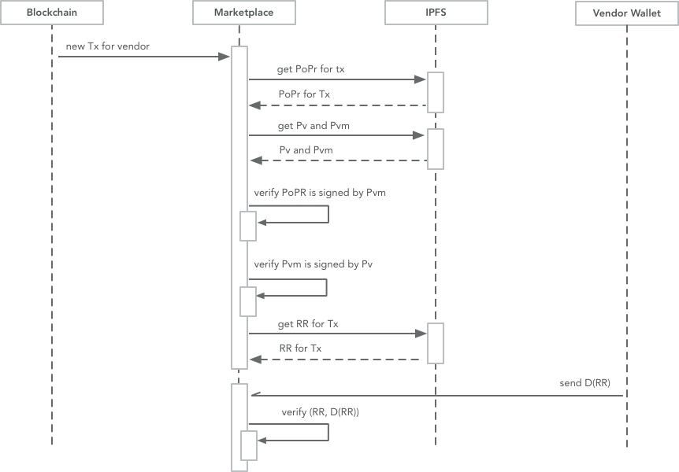

# Abstract

Chlu is an open protocol to capture ratings and reviews that can be
validated by payments made via permissionless crypto currencies like
Bitcoin, Litecoin, ZCash and Ethereum.

No new blockchain is required to support Chlu, and there are no
changes required to any existing blockchains. Chlu is completely
implemented at wallet end. Marketplaces that want to integrate with
Chlu do so through libraries that provide implementations of Chlu
protocols.

This document defines protocols for Chlu customer and vendor wallets
as well as support libraries for marketplaces.

# Motivation

Chlu protocol solves the twin problem of vendor reputation locked
inside marketplace walled gardens as well as fake reputation data
generated by vendors.

## Breaking free from reputation walled gardens ##

At the moment, there is no way for a vendor to be in control of his
reputation data, and if a vendor wants to start selling their services
or products in a new marketplace, they have to start with zero
reputation, even if they have a long history on a different
marketplace.

## Eliminating fake reviews ##

Numerous marketplaces and search engines allow users to leave reviews
for a business without any verified purchase. Some businesses take
adavantage of such systems by creating fake reviews for
themselves. Chlu addresses this problem by requiring a user to prove
they paid a vendor and that the vendor requested a payment from the
user before allowing the user to leave a review and rating.

# Protocol

Chlu requires a number of components to work together to deliver the
goals outlined above. The key components are

1. Vendor Wallet
2. Customer Wallet, and
3. Marketplace library

Each of these componets can be provided by any third party, as long as
these components follow the protocol described here. To be clear the
terms 'vendor wallet provider', 'customer wallet provider' and 'market
place library provider' are used in this document to mean any open
source project or company providing an implementation of the
appropriate component.

The document describes protocols for each of the components, but first
the various data structures and messages required by the protocols are
defined.

# Data Structures

## Proof of payment request (PoPR)

PoPR captures the request created by a vendor to make a payment

```proto
    message PoPR {
        message ReviewAttribute {
            required string name = 1;
            required uint32 min_rating = 2;
            required uint32 max_rating = 3;
            required string description = 4;
            required boolean is_required = 5;
        }
        optional string item_id = 1;
        optional string invoice_id = 2;
        optional string customer_id = 3;
        optional uint64 created_at = 4;
        optional uint64 expires_at = 5;
        required string currency_symbol = 6;
        required uint64 amount = 7;
        optional string marketplace_url = 8;
        optional string marketplace_vendor_url = 9;
        required string key_location = 10;
        required uint32 chlu_version = 11;
        repeated ReviewAttribute attributes = 12;
        required string signature = 13;
    }
```

Field | Description
----- | -----------
item_id | A unique ID for the item from the marketplace or the vendor's site
invoice_id | The ID of the invoice generated by the marketplace or the vendor's site
customer_id | The ID of the invoice generated by the marketplace or the vendor's site
created_at | A unix timestamp (UTC) for when the payment request was generated
expires_at | A unix timestamp (UTC) for when the payment request expires
currency_symbol | The currency symbol of the cryptocurrency used to make the payment
amount | Number of base units in currency (e.g. Satoshis when using BTC)
marketplace_url | URL of the marketplace where sale is taking place
marketplace_vendor_url | URL of the vendor's profile on the marketplace
key_location | The IPFS content address where the vendor's public key is available
chlu_version | The Chlu protocol version, see more in Versioning section
attributes | Any detailed review attributes that the market wants the customer wallet to capture
signature | Signature of all of the above, signed by the vendor's private key available to the marketplace or directly signed by the vendor

### ReviewAttribute

A marketplace or a vendor can include request for a detailed review by
enclosing one or more ReviewAttributes. If included in the PoPR,
each of these should be presented to the customer.

Field | Description
----- | -----------
name | The name of the attribute
min_rating | The minimum value for the rating (usually 1)
max_rating | The maximum value for the rating (usually 5)
description | The description of the attribute
is_required | Is this attribute required to be completed

### Generating PoPR ###

A PoPR can be generated directly by a vendor and shared with the
customer using Facebook App Links or any other means for the wallet
provider to send the PoPR.

A PoPR can also be generated by the marketplace library if a customer
is checking out of the marketplace and making a payment to the vendor
through a Chlu wallet.

If the customer opens the PoPR after the ```expires_at``` timestamp
the wallet should not allow the payment to be made and should inform
the customer of the expiry.

When customer opens the PoPR the customer wallet should show the
```currency_symbol``` selected and the ```amount``` quoted along with
the equivalent base fiat currency the customer has selected. More
about this in the Customer Wallet Setup section.

## Review Record

This data structure saves the review created by the customer for the
vendor.

```proto
    message ReviewRecord {
        message DetailedReview {
        required string attribute = 1;
        required string review_text = 2;
        required uint32 rating = 3;
    }
    required string currency_symbol = 1;
    required int32 amount = 2;
    required string customer_address = 3;
    required string vendor_address = 4;
    optional string review_text = 5;
    optional uint32 rating = 6;
    repeated DetailedReview detailed_review = 7;
    required PoPR popr = 8;
    required uint32 chlu_version = 9;
    required string hash = 10;
}

```

Field | Description
----- | -----------
currency_symbol | The currency symbol of the cryptocurrency used to make the payment.
amount | Number of base units in currency (e.g. Satoshis when using BTC).
customer_address | Address of the customer in the selected cryptocurrency
vendor_address | Address of the vendor in the selected cryptocurrency
review_text | The text of the review left by the customer. Optional because the customer can choose to not review.
rating | The overall rating, from 1 to 5, left by the customer. Optional because the customer can choose to not provide a rating.
detailed_review | A list of ```DetailedReview``` that contains any other details a marketplace wants to capture about the review.
popr | The Proof of Payment Request sent by the vendor to the customer. The customer wallet must include this to allow validation of the review.
hash | The SHA256 hash of all the contents of the ```ReviewRecord```. This is useful for validating the review, as described in the Validating a Review section.

### DetailedReview

Marketplaces are free to require customers to provide any details in a
review, as shown in the ```attributes``` field of ```PoPR```. The
Customer Wallet must show present these in a way that the Customer can
answer the required review questions.

### Saving Review Records

The entire contents of the review record are hashed using SHA256 and
saved in the ```hash``` field. Further, the entire contents (apart
from the hash) are encrypted using the vendor public key accessible
from IPFS. The location of the key and how it should be accessed by
the Customer Wallet is described in the Vendor Wallet Setup section.

## Payment Record

This is the transaction details stored on the blockchain. For example,
on Bitcoin the customer address, the vendor address and the amount are
available as inputs and outputs.

```proto
    message PaymentRecord {
        required string customer_address = 1;
        required string vendor_address = 2;
        required int32 amount = 3;
        required ReviewRecord review_record = 4;
    }
```

Field | Description
----- | -----------
customer_address | Address of the customer in the selected cryptocurrency
vendor_address | Address of the vendor in the selected cryptocurrency
amount | Number of base units in currency (e.g. Satoshis when using BTC)
review_record | The IPFS content address where the review is stored

# Vendor Wallet Setup

The vendor wallet setup has to achieve the following goals:

1. Enable marketplaces to sign a PoPR.
2. Enable wallets to sign a PoPR when directly sending a payment request.
3. Enable reviews to be encrypted by customer wallets.

To achieve the above, the following key pairs have to be generated and
managed by the wallet:

1. Key pair used to sign and verify PoPR.
2. Key pair used to encrypt and decrypt Review Record.

### Setup IPNS for the vendor ###

A new key should be generated on IPFS and then an IPNS name should be
published for the vendor. This IPNS location is used to publish vendor
keys as described in the next section. It is up to the wallet provider
how the vendor IPFS key is created and safe guarded. The wallet also
has to make sure this key is exported when the wallet is exported, as
described in the Exporting Wallet section. The wallet also has to make
sure the key can be imported and IPNS setup completed with the
imported key.

### Setup Signing Key Pair (Sv, Pv) ###

When the vendor is setting up their wallet for the first time, a new
key pair should be generated to be used for signing the PoPR. They key
pair should be an elliptical curce key pair using the same curve as
the one used in bitcoin - secp256k1.

This key pair is different from the key pair used to generate bitcoin
or other cryptocurrencies key pairs and addresses.

The wallet needs to store the private key, Sv, in the wallet's
persistent storage and let the vendor know this key is important to
keep receiving reviews that can be validated in the future.

The public key, Pv should be stored in the IPNS location created
as described earlier in the 'Setup IPNS for the vendor' section.

Wallets can also allow a means for the vendor to export this key pair
for safe keeping. In such cases wallets should allow importing the
exported key to reinitialize the wallet.

### Setup Encryption key pair (Sve, Pve) ###

Wallets have to generate another key pair of type RSA with 2048
length. This public key of this key pair is saved on IPNS as a file
and the content hash saved in persistent storage by the wallet.

The sequence diagram shows the wallet setup for vendor wallet.


## Exporting Wallet ##

At the time of exporting wallet data so that it can be used in another
Chlu wallet, the wallet has to export all of the following:

1. Enough information so that key pairs for all the blockchains used
   by the vendor can be imported in other wallets. Most key pairs can
   be exported as mnemonics and key paths, but others like Ethereum
   require a secret that can be saved. Chlu wallets should export all
   such required information for all cryptocurrencies supported.
2. Wallets should export the Signing and Encryption key pairs as
   well. A mnemonic can be used to export the signing key pair, and an
   RSA encryption key should be exported in PEM/base64 format
3. Finally, wallets have to export the IPFS RSA key used to publish
   content under the vendor's name.

# Customer Wallet Setup

Setting up a customer wallet is less involved than the vendor
wallet. The wallet should enable the customer to import keys or create
new keys for all the crypto currencies supported by the wallet.

The wallet must also allow exporting all the keys in the same way as
described in the Exporting Wallet section.

The wallet setup should also make sure that there is a means to
connect with, read and write to IPFS.

### Setup IPNS for the customer ###

A new key should be generated on IPFS and then an IPNS name should be
published for the customer. This process is the same as followed for
the vendor wallet setup. IPNS is used to publish reviews authored by
the customer. This enables a customer to update the review or even
defer writing the first review until after the product has been
received. The section 'Updating a review' describes this in detail.

It is up to the wallet provider how the vendor IPFS key is created and
safe guarded. The wallet also has to make sure this key is exported
when the wallet is exported, as described in the Exporting Wallet
section.

# Making a payment with review

When a payment is made, the customer wallet has to make sure 1) review
is saved to IPFS and 2) the review content address is saved as part of
the cryptocurrency payment.

The payment made conforms to the Payment Record message described
above and available [here](./protobuf/payment.proto "payment.proto").

The Payment Record includes a reference to the Review Record which
inturn holds a reference to the Proof of Payment Request.

The customer wallet must save a review record with the required fields
and include it in the Payment Record, even if the customer is not
leaving a review. The presence of Review Record in the Payment Record
is essential to enable validation of the Payment and the Review.


The sequence diagram shows the protocol for customer wallet to create
and save the review as well as make a payment transaction on any
supported cryptocurrency. The process is triggered by the customer on
receiving a payment request from the vendor or marketplace.


## Updating a review

All the reviews by a customer are published under an IPNS location
controlled by the customer's wallet. A customer can create a new
review without requiring any permission. 

To achieve the above, the customer wallet has to save the review under
the customer's IPNS location and include the original PoPR the
customer received.

The above proves that the the customer is overwritting the earlier
review and the customer has purchased the relevant good from the
vendor.

The next section describes the protocol used to validate a review.

# Validating a review

Marketplace libraries that load and list reviews for a vendor should
validate the reviews before doing so. If reviews are not valid, the
marketplace must not list them, or if the marketplace still chooses to
do so, it must explicitly inform the user that the review is not
validated as per Chlu protocol.

## Discovering reviews for a vendor

Marketplaces can discover reviews for a vendor when a vendor chooses
to share the reviews with the market. A vendor can share the review
and ratings data in a couple of different ways.

1. A vendor shares the list of addresses and cryptocurrencies where
   the vendor recieves payments.
2. A vendor runs a service to push reviews to a marketplace. The
   vendor wallet can choose to provide this service to the vendor, but
   it is not a required feature. The review record has a reference to
   the payment captured by customer_address, vendor_adress and the
   currency symbol

To validate a review a marketplace must follow the protocol:

1. For a given review, fetch the Proof of Payment Requested, PoPR.
2. Fetch the vendor public signature key, Pv from the vendors IPNS
   name listed in the PoPR's ```key_location``` attribute.
3. Validate PoPR using Pv.
4. Verify that the contents of the Review Record result in the same
   hash as included in the Review Record.

If any of the verifications in the above procedure fail, the
marketplace must not include the review in the vendor profile, or
explicitly mark the review as 'not verified with Chlu.'

The sequence diagram below describes the above process.



## Review completeness

Marketplaces must provide users with all validated reviews found for a
vendor. Marketplaces can choose to order them in anyway, and run any
statistics and/or algorithms to derive vendor reputation scores, but
they should not make any validatable review inaccessible to its users.

# Versioning

The protocol buffers serialization format is designed to be
extensible. In particular, new, optional fields can be added to a
message and will be ignored (but saved/re-transmitted) by old
implementations.

ReviewRecord and PoPR messages may be extended with new optional
fields and still be considered "version 1." Old implementations will
be able to validate ReviewRecords against PoPRs containing the new
fields, but will not be able to display whatever information is
contained in the new, optional fields to the user.

If it becomes necessary at some point in the future for vendors to
produce PoPR messages that are accepted *only* by new implementations,
they can do so by defining a new PoPR and ReviewRecord message with
version=2. Old implementations should let the user know that they need
to upgrade their software when they get an up-version PoPR and
ReviewRecord messages.

# Reference implementation

ChluNetwork's WIP reference implementation:
[https://github.com/ChluNetwork/chlu-demo](https://github.com/ChluNetwork/chlu-demo)


ChluNetwork's WIP reference implementation javascript support
libraries: [https://github.com/ChluNetwork/chlu-wallet-support-js](https://github.com/ChluNetwork/chlu-wallet-support-js)

# See Also 

Bitcoin's Payment Protocol BIP70:
[https://github.com/bitcoin/bips/blob/master/bip-0070.mediawiki](https://github.com/bitcoin/bips/blob/master/bip-0070.mediawiki)
